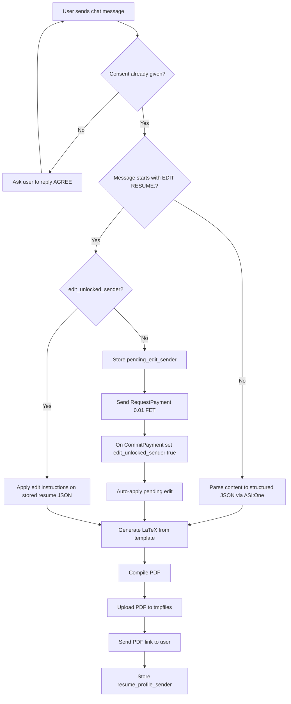

# AI Resume Agent


Content-only resume generator agent using Fetch.ai chat protocol.

## What this agent does

- Accepts raw resume content from chat and builds a structured ATS-friendly profile
- Generates a printable LaTeX resume, compiles it to PDF, and uploads it to a temporary URL
- Returns only the final PDF link to the user
- Supports paid resume editing with `0.01 FET` payment
- Stores per-user state so edits can be applied to the latest generated resume

## Features

- Takes raw resume content from user chat (no LinkedIn/GitHub profile fetch dependency)
- Converts content to structured JSON using ASI:One
- Generates LaTeX, compiles PDF, uploads to tmpfiles, returns only PDF link
- Supports paid resume editing via `EDIT RESUME:` command
- Editing is gated behind `0.01 FET` payment request
- Maintains user state in storage (consent, last resume JSON, pending edit)

## Commands (chat)

- **Create resume:** send full resume content in plain text
- **Edit resume:** `EDIT RESUME: <your changes>`
  - Example: `EDIT RESUME: Replace summary with backend-focused version and add Kubernetes in skills`
  - If payment is required, complete `0.01 FET`; pending edit is auto-applied immediately after payment verification.

## Example queries

- **Generate resume (plain content)**
  - `Name: Gautam Kumar. Experience: 2+ years in full stack development with Python, React, Node.js...`
- **Generate resume (JSON)**
  - `{"name":"Your Name","email":"you@example.com","summary":"...", "experience":[...], "projects":[...], "education":[...], "skills":[...]}`
- **Edit existing resume**
  - `EDIT RESUME: Make summary backend-focused and add PostgreSQL, Redis, and Docker in skills.`
- **Edit for job alignment**
  - `EDIT RESUME: Tailor my experience bullets for a Senior Backend Engineer role and highlight API performance work.`

## State flow

- `consent_<sender>`: privacy consent flag
- `resume_profile_<sender>`: latest structured resume JSON memory
- `pending_edit_<sender>`: queued edit instructions before payment
- `edit_unlocked_<sender>`: edit payment unlock flag

## Workflow (Mermaid)



## Environment variables

Create `.env` with:

```env
AGENT_SEED_PHRASE=your_seed_phrase
ASI_ONE_API_KEY=your_asi_one_api_key
ADMIN_ADDR=optional_admin_address
```

## Local run

```bash
python3 -m venv .venv
source .venv/bin/activate
pip install -r requirements.txt
python agent.py
```

## Docker run

```bash
docker compose up --build
```

Agent runs on `http://0.0.0.0:8001`.

## File structure

- `agent.py` - chat flow, content parsing, resume generate/edit pipeline
- `resume_generator.py` - LaTeX render + PDF compile
- `templates/resume_template.tex.j2` - printable resume template
- `payment_module.py` - payment protocol handlers (`0.1 FET` premium + `0.01 FET` edit unlock support)

## Notes

- For PDF compile, LaTeX tools must be installed in runtime container/host.
- If upload fails, agent reports upload error instead of sending LaTeX code.
