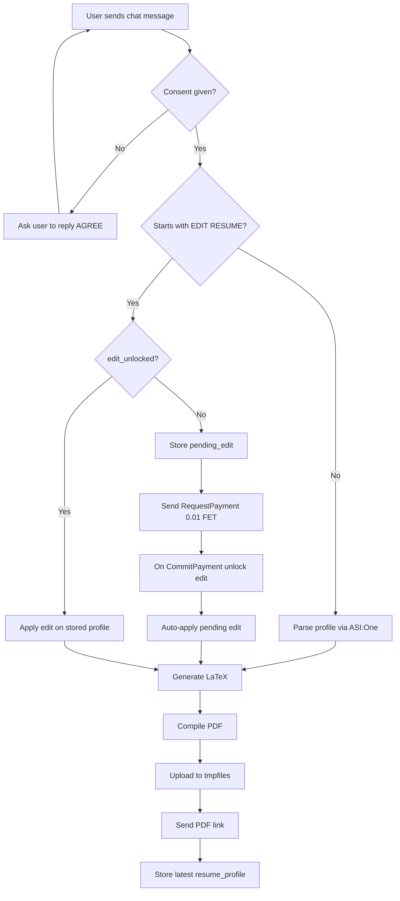

# AI Resume Agent


An AI assistant that helps users create and refine **ATS-friendly resumes** from plain text or JSON input. It converts resume content into a structured profile, generates a printable PDF, uploads it, and returns a shareable link. It supports paid edit unlock via Fetch.ai payment protocol.

---

## What it does

- **Resume generation** — Converts raw content into structured resume JSON.
- **ATS optimization** — Uses concise, impact-oriented wording for resume sections.
- **PDF pipeline** — Renders LaTeX, compiles PDF, uploads to temp storage, sends link.
- **Resume editing** — Supports `EDIT RESUME:` updates on the last saved profile.
- **Payment-gated edits** — Requires `0.01 FET` to unlock editing.
- **State memory** — Keeps consent, latest profile, pending edit, and edit unlock per sender.

---

## Example queries

| You might ask... |
|------------------|
| *Create my resume from this content: Name..., Experience..., Projects..., Skills...* |
| *Generate a one-page ATS resume for Python backend roles from this profile text.* |
| *EDIT RESUME: Make summary backend-focused and add PostgreSQL + Redis in skills.* |
| *EDIT RESUME: Tailor my bullets for a Senior Full Stack Engineer job.* |
| *Improve project descriptions with measurable outcomes and action verbs.* |
| *Update resume for a Developer Advocate role and highlight speaking/community work.* |

---

## Workflow



---

## Environment variables

Create `.env`:

```env
AGENT_SEED_PHRASE=your_seed_phrase
ASI_ONE_API_KEY=your_asi_one_api_key
ADMIN_ADDR=optional_admin_address
```

---

## Run locally

```bash
python3 -m venv .venv
source .venv/bin/activate
pip install -r requirements.txt
python agent.py
```

---

## Run with Docker

```bash
docker compose up --build
```

Agent listens on `http://0.0.0.0:8001`.

---

## Railway deployment note

- This repo includes both `Dockerfile` and `nixpacks.toml` with LaTeX dependencies.
- If deploying with Docker on Railway, `pdflatex` is installed via apt packages in `Dockerfile`.
- If deploying with Nixpacks, `texlive.combined.scheme-small` is installed via `nixpacks.toml`.
- After redeploy, check logs for successful PDF compile (no `pdflatex not installed` error).
